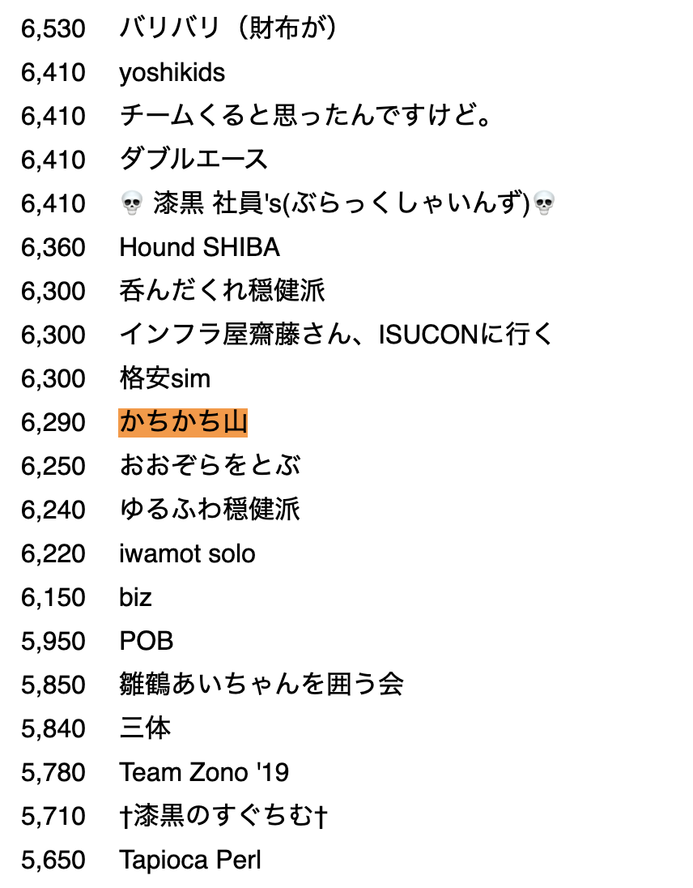

**かちかち山** というチームで同僚と初参加しました。いつもお尻に火が付いている。  

スコアがついている430チーム中95位くらい ([参考値](http://isucon.net/archives/53789925.html)) のグズグズ。  

次はもうちょっといける。

## 予習で参考にしたページ

### ISUCON について

* ISUCON
  * [ISUCON8 まとめ](http://isucon.net/archives/52388756.html)
  * [ISUCON8 本選 関連エントリまとめ](http://isucon.net/archives/52585409.html)
  * [ISUCON8 本選問題の解説と講評](http://isucon.net/archives/52598691.html)
* 参加チーム
  * [ISUCON8 本戦にて優勝してきました](https://blog.whywrite.it/2018/10/22/isucon8-final/)
  * [ISUCON8 本戦に出てまあまあだった話](https://hikalium.hatenablog.jp/entry/2018/10/20/225806)
  * [ISUCON8で準優勝した](https://math314.hateblo.jp/entry/2018/10/30/005125)
  * [ISUCON予選突破を支えたオペレーション技術](https://blog.yuuk.io/entry/web-operations-isucon)
  * [ISUCONで学ぶ Webアプリケーションのパフォーマンス向上のコツ 実践編 完全版](https://www.slideshare.net/kazeburo/isucon-summerclass2014action2final)
  * [ISUCONの勝ち方 YAPC::Asia Tokyo 2015](https://www.slideshare.net/kazeburo/isucon-yapcasia-tokyo-2015)
  * [ISUCON4 予選でアプリケーションを変更せずに予選通過ラインを突破するの術](https://kazeburo.hatenablog.com/entry/2014/10/14/170129)
  * [isucon8本戦は低レイヤーがネックにならない良問だった](https://chy72.hatenablog.com/entry/2018/10/29/212154)

### Linux

* [Linuxサーバにログインしたらいつもやっているオペレーション](https://blog.yuuk.io/entry/linux-server-operations)

### MySQL

* [MySQLのEXPLAINを徹底解説!!](http://nippondanji.blogspot.com/2009/03/mysqlexplain.html)
* [MySQLでのSlowLogの分析方法](https://qiita.com/tamano/items/50c7d7ee08b133a18b97)
* [MySQL パーティショニングで高速クエリーを実現！！](https://hit.hateblo.jp/entry/mysql/PARTITION)
* [MySQLパーティショニングの設定、追加、削除、再構成](https://qiita.com/colorrabbit/items/d81c6daff4800d735bdc)
* [第9回　pt-query-digestを使って遅いクエリーを発見する](http://gihyo.jp/dev/serial/01/mysql-road-construction-news/0009)
* [LOCK IN SHARE MODE の使いドコロを間違えてデッドロック](https://ngyuki.hatenablog.com/entry/2013/04/22/151042)

### Nginx

* [Nginx Fastcgi Reverse Proxy Cache for PHP (Symfony)](https://medium.com/@stefan.poeltl/nginx-fastcgi-reverse-proxy-cache-for-php-symfony-d98d8eccf11e)